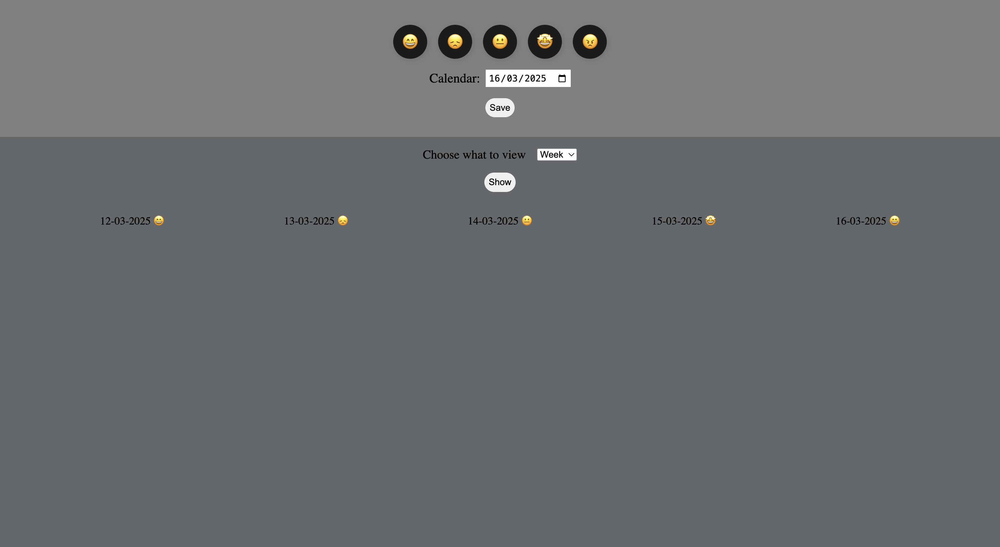
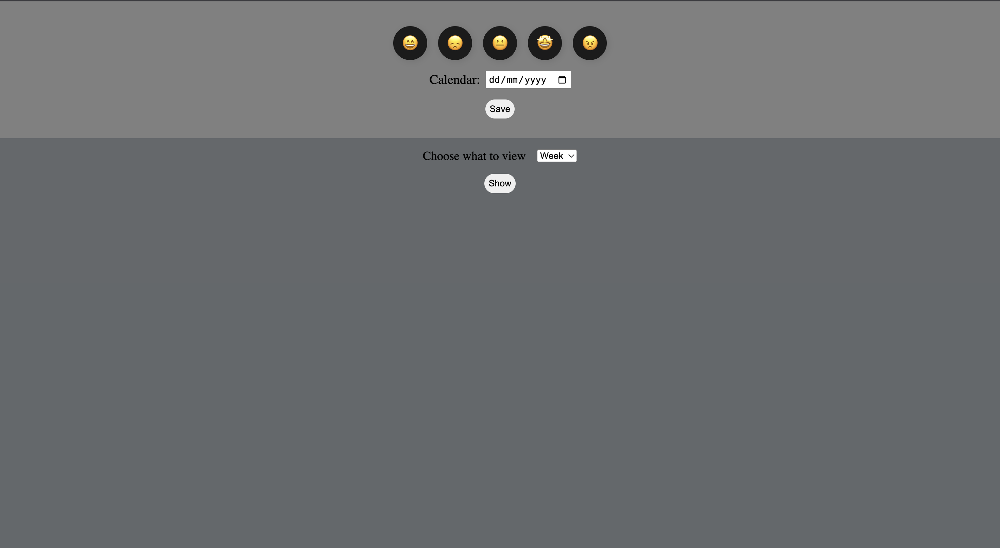

# Mood Tracker

## Overview
This is a simple web-based Mood Tracker that allows users to log their daily mood and view past mood records based on a selected time range (Week, Month, or Year). The moods are stored using LocalStorage for persistence.

## Features
- Select and log moods using emoji buttons.
- Choose a date for mood entry.
- Store and retrieve mood logs from LocalStorage.
- View mood history for a week, month, or year.

## Technologies Used
- **HTML**: Structure of the web page.
- **CSS**: Basic styling and layout.
- **JavaScript**: Functional logic for mood selection, logging, and retrieval.
- **LocalStorage**: Stores mood entries persistently in the browser.

## How to Use
1. Click on a mood emoji to select your mood.
2. Pick a date using the calendar input.
3. Click the **Save** button to store the mood entry.
4. Select a view option (Week, Month, Year) from the dropdown.
5. Click the **Show** button to view stored mood logs.

## File Structure
- **index.html**: Contains the structure of the application.
- **style.css**: Provides basic styling.
- **script.js**: Implements mood tracking and data persistence logic.

## Future Improvements
- Improve UI with better styling and animations.
- Add a visual representation of mood trends (charts/graphs).
- Implement user authentication for personalized tracking.

## Screenshot

## Author
Developed by Sumit Raskar

